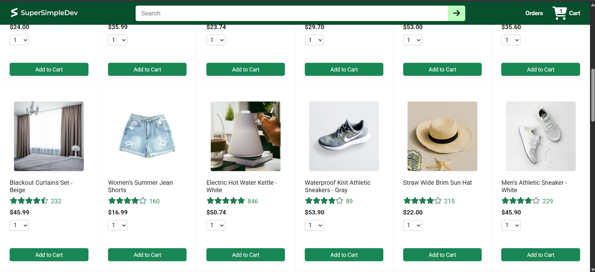
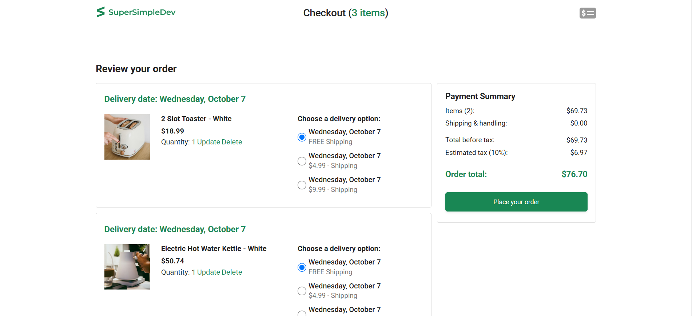
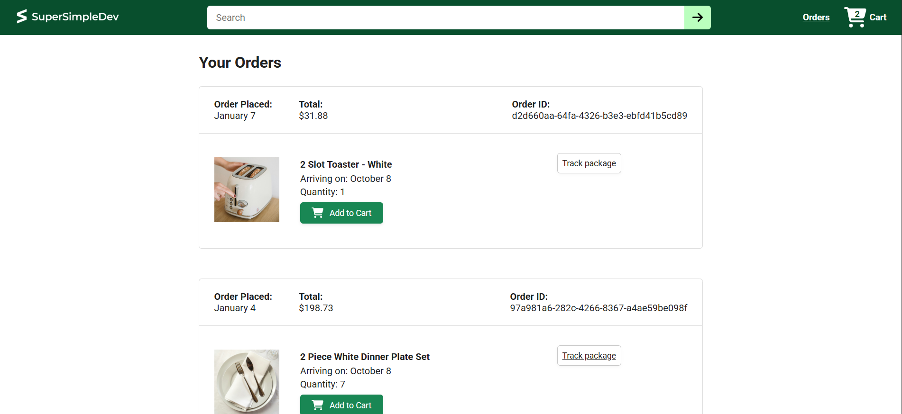
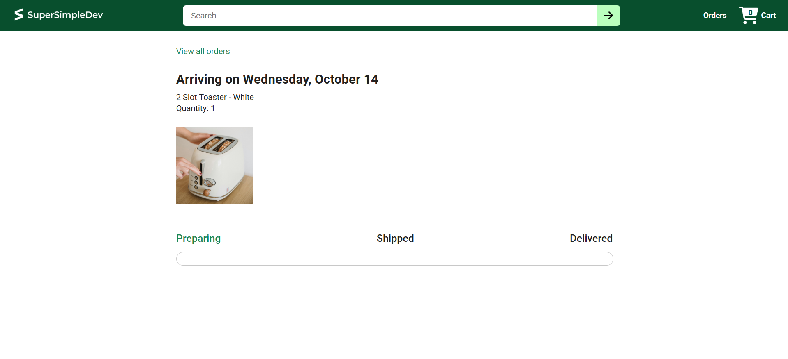

# E-Commerce Front-End (React)

A multi-page e-commerce web app built with **React**. Users can browse and search products, add them to a cart, choose delivery options, place an order, review past orders, and track a package.

I built this while learning React through a YouTube course. The **back-end API was provided by the course instructor** and I did not modify it. **Everything in the front-end, and all of the integration with the API, is my own work.**

## Live Demo

[](https://ecommerce-project-7zfp-git-main-boarey.vercel.app/)

---

## Screenshots

| Products | Checkout |
|---|---|
|  |  |

| Orders | Tracking |
|---|---|
|  |  |

---

## What the App Does

- **Browse and search products**: products load from the API, with a search bar in the header that filters results through a `?search=` query parameter.
- **Add to cart**: choose a quantity (1–10) and add a product. A short "Added" confirmation appears, and the cart count in the header updates.
- **Manage the cart**: update an item's quantity (Enter to confirm, Escape to cancel) or delete it.
- **Choose delivery options**: each cart item has its own delivery option, and the estimated delivery date updates when you switch.
- **Payment summary**: items, shipping, tax, and order total come from the API and refresh whenever the cart changes.
- **Place an order**: creates the order, refreshes the cart, and redirects to the Orders page.
- **Order history**: lists past orders with date, total, ID, and products, plus an "Add to Cart" button to buy an item again.
- **Package tracking**: shows a Preparing → Shipped → Delivered progress bar calculated from the order time and the estimated delivery time.
- **404 page**: unknown routes show a "Page not found" page.

---

## Tech Stack

| Area | Tools |
|---|---|
| UI | React 19 (function components and hooks) |
| Routing | React Router 7 |
| HTTP | Axios |
| Dates | Day.js |
| Build tool | Vite |
| Testing | Vitest, React Testing Library, user-event, jest-dom, jsdom |
| Linting | ESLint |
| Styling | Plain CSS, one stylesheet per page or component |

---

## What I Built and Practiced

**React fundamentals**
- Splitting the UI into small components: `Header`, `ProductsGrid`, `Product`, `OrdersGrid`, `OrderDetailsGrid`, `PaymentSummary`, and others.
- Passing data and callbacks through props.
- Managing local state with `useState` (quantity selector, "Added" message, edit mode for cart quantity, search text).
- Fetching data and reacting to changes with `useEffect` and dependency arrays. For example, products re-fetch when the search term changes, and the payment summary re-fetches when the cart changes.
- Rendering lists with `map` and stable `key` props, and using conditional rendering.

**Routing**
- Page routes with React Router: `/`, `/checkout`, `/orders`, and a catch-all 404.
- A dynamic route, `/tracking/:orderId/:productId`, read with `useParams`.
- Search state kept in the URL with `useSearchParams`, and programmatic navigation with `useNavigate`.

**API integration** (the part I handled on the front-end side)
- `GET`, `POST`, `PUT`, and `DELETE` requests with Axios against the provided REST API.
- Using the API's `expand` query parameters to get related data (for example `?expand=product`) in a single request.
- Keeping the cart in one place (`App`) and passing a `loadCart` function down, so every page refreshes the same cart state after a change.
- Cleaning up an in-flight request in the tracking page so a stale response doesn't overwrite newer data.
- Configurable API base URL through the `VITE_API_URL` environment variable, with a Vite dev-server proxy for local development.

**Testing**
- Unit tests for the `formatMoney` utility.
- Component tests for `HomePage`, `Product`, `PaymentSummary`, and `OrderDetailsGrid` with Vitest and React Testing Library.
- Mocking Axios with `vi.mock`, wrapping components in `MemoryRouter`, simulating clicks and selections with `user-event`, and querying elements by role and `data-testid`.

**Tooling**
- Setting up and running a Vite + React project, with separate Vite and Vitest configs.
- Linting with ESLint.

**CSS**
- Page layouts with CSS (grids and flexbox), including separate desktop and mobile logos in the header.

---

## Project Structure

```
ecommerce-project/        # Front-end (my work)
├── src/
│   ├── components/       # Shared components (Header)
│   ├── pages/
│   │   ├── home/         # Product list, product card, search
│   │   ├── checkout/     # Order summary, delivery options, payment summary
│   │   ├── orders/       # Order history, cart item details
│   │   ├── Tracking.jsx  # Package tracking
│   │   └── NotFoundPage.jsx
│   ├── utils/            # formatMoney, imageUrl (+ tests)
│   ├── App.jsx           # Routes and shared cart state
│   └── main.jsx          # App entry point
├── vite.config.js
├── vitest.config.js
└── package.json

ecommerce-backend/        # Back-end (provided by the course instructor, unmodified)
```

---

## Getting Started

**Requirements:** Node.js and npm.

**1. Start the back-end** (it runs on port `3000`):

```bash
cd ecommerce-backend
npm install
npm start
```

**2. Start the front-end** in a second terminal:

```bash
cd ecommerce-project
npm install
npm run dev
```

Open the local URL that Vite prints. The dev server proxies `/api` and `/images` requests to `http://localhost:3000`.

**Other commands**

```bash
npm run build      # Production build
npm run preview    # Preview the production build
npm run lint       # Run ESLint
npx vitest         # Run the tests
```

To point the front-end at a different API, set `VITE_API_URL` in an environment file.

---

## API Endpoints Used

The back-end documentation describes the API; these are the endpoints the front-end uses:

| Method | Endpoint | Used for |
|---|---|---|
| GET | `/api/products` (`?search=`) | Product list and search |
| GET | `/api/cart-items?expand=product` | Loading the cart |
| POST | `/api/cart-items` | Adding to the cart |
| PUT | `/api/cart-items/:productId` | Updating quantity or delivery option |
| DELETE | `/api/cart-items/:productId` | Removing an item |
| GET | `/api/delivery-options?expand=estimated-delivery-time` | Delivery choices and dates |
| GET | `/api/payment-summary` | Checkout totals |
| POST | `/api/orders` | Placing an order |
| GET | `/api/orders?expand=products` | Order history |
| GET | `/api/orders/:orderId?expand=products` | Tracking page data |

---

## Credits and Scope

- **Learning source:** a YouTube React course. The project follows that course's e-commerce app, and I used it to learn React.
- **Back-end:** provided by the course instructor and included here only so the app can run. I did not write or change it.
- **Front-end and API integration:** written by me.

---

## What I'd Like to Improve Next

- Add loading and error states for failed API requests.
- Add form validation for the cart quantity input.
- Add tests for the cart and tracking pages.
- Learn a state-management approach (such as Context) to reduce prop passing.
